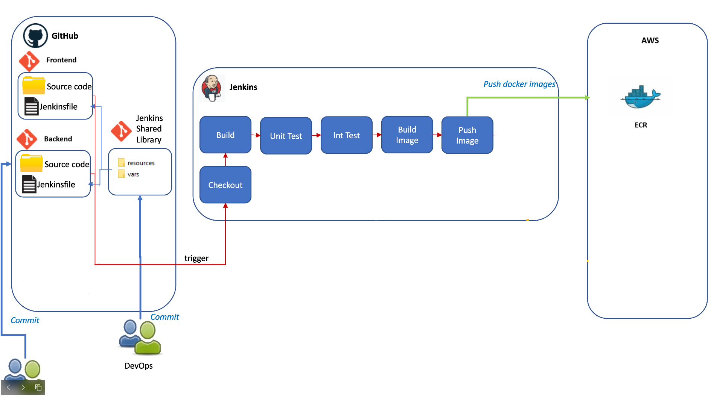

					____  _______     ______  _____ ____ ___  ____  ____  
					|  _ \| ____\ \   / / ___|| ____/ ___/ _ \|  _ \/ ___| 
					| | | |  _|  \ \ / /\___ \|  _|| |  | | | | |_) \___ \ 
					| |_| | |___  \ V /  ___) | |__| |__| |_| |  __/ ___) |
					|____/|_____|  \_/  |____/|_____\____\___/|_|   |____/ 

# DevSecOps Project
This is the devsecops project and will contain all automation related to CI Architecture. 



 
Folder Structure
 - assets - include some images that used for the documentation
 - resources - Jenkins Library Resources allows the libraryResource step to be used from an external library to load associated non-Groovy files
 - src - directory should look like standard Java source directory structure. It include class or method is reused by the pipeline
 - vars - Jenkins Libarary Scripts (Only entire pipelines can be defined in shared libraries as of this time. This can only be done in vars/*.groovy, and only in a call method. Only one Declarative Pipeline can be executed in a single build, and if you attempt to execute a second one, your build will fail as a result.)

# What you'll learn
- Understand the basics of the Jenkins architecture.
- Understand the concept of the Job DSL Plugin on Jenkins and its features.
- Understand with Shared Libraries and Plug-ins
- Implement CICD Pipelines Security With Jenkins Groovy script
- Understand the basic scenario CICD flow

# Prerequisite
- Working knowledge of Jenkins
- Basic knowledge of automation and the CI-CD strategy
- Basic knowledge of Docker and EKS

# Install Jenkins
- Install JDK
  	```
      sudo apt update
      sudo apt install openjdk-17-jre -y
      sudo apt install openjdk-17-jdk
   	```
- Install Jenkins
  	```
   curl -fsSL https://pkg.jenkins.io/debian-stable/jenkins.io-2023.key | sudo tee \
  /usr/share/keyrings/jenkins-keyring.asc > /dev/null
   echo deb [signed-by=/usr/share/keyrings/jenkins-keyring.asc] \
  https://pkg.jenkins.io/debian-stable binary/ | sudo tee \
  /etc/apt/sources.list.d/jenkins.list > /dev/null
   sudo apt-get update
   sudo apt-get install jenkins -y
   	```
# Install Docker
```
# Add Docker's official GPG key:
sudo apt-get update
sudo apt-get install ca-certificates curl gnupg
sudo install -m 0755 -d /etc/apt/keyrings
curl -fsSL https://download.docker.com/linux/ubuntu/gpg | sudo gpg --dearmor -o /etc/apt/keyrings/docker.gpg
sudo chmod a+r /etc/apt/keyrings/docker.gpg

# Add the repository to Apt sources:
echo \
  "deb [arch="$(dpkg --print-architecture)" signed-by=/etc/apt/keyrings/docker.gpg] https://download.docker.com/linux/ubuntu \
  "$(. /etc/os-release && echo "$VERSION_CODENAME")" stable" | \
  sudo tee /etc/apt/sources.list.d/docker.list > /dev/null
sudo apt-get update

sudo apt-get install docker-ce docker-ce-cli containerd.io docker-buildx-plugin docker-compose-plugin

# Add Jenkins user into docker group
sudo usermod -aG docker jenkins
sudo usermod -aG docker $USER

# Check docker version
docker -v
```

***Note: Log out shell and login again***

# Install git
```
   sudo apt-get install git-all
```

# Install Trivy
```
# Debian/Ubuntu 
sudo apt-get install wget apt-transport-https gnupg lsb-release
wget -qO - https://aquasecurity.github.io/trivy-repo/deb/public.key | sudo apt-key add -
echo deb https://aquasecurity.github.io/trivy-repo/deb $(lsb_release -sc) main | sudo tee -a /etc/apt/sources.list.d/trivy.list
sudo apt-get update
sudo apt-get install trivy
Refer: https://aquasecurity.github.io/trivy/v0.53/getting-started/installation/
```

# Requirement
- Jenkins Server has
	- installed some
		- Plugins: 
			- Jenkins suggested (Will install when login first time)
 			- Additional Plugin: http://JenkinIP:8080/manage/pluginManager/available
				- Docker Pipeline
				- Cobertura
				- HTML Publisher
				- Pipeline Utility Steps
				
		- Tools: http://JenkinIP:8080/manage/configureTools/
	- added credentials: http://JenkinIP:8080/manage/credentials/store/system/domain/_/
		- GitHub with Kind Username with password (ID name: github)
			+ username: github username
			+ password: generate the new token with full permissions ( https://github.com/settings/tokens )\
			-> Create the github credentials to access github: 
			
		- Dockerhub with Kind Username with password (ID name: dockerhub-demo-token)
			+ username: dockerhub username
			+ password: generate the new token with full permissions ( https://hub.docker.com/settings/security ) \
			-> Create the dockerhub credentials to access dockerhub to store container images
			
	- Setup the Jenkins System to connect Github and shared libaries: http://JenkinIP:8080/manage/configure
   		- GitHub Enterprise Servers
			- API endpoint: https://api.github.com
			- Name: github
		
		- Global Pipeline Libraries
			- Name: ```jenkins-devops-ci```
			- Default version: ```main```
			- [x] Allow default version to be overridden
			- [x] Include @Library changes in job recent changes 
			- Retrieval method: Modern SCM
				- Source Code Management: Git
				- Project Repository: https://github.com/victoriaman/sd3500_jenkins_devops_ci.git
				- Credentials: ```github```
    	

- Repositories: Create new github orginization and add the repositories
	- Create new github orginization: 
		- URL: https://github.com/account/organizations/new?plan=free
		- Organization name: the new org name
		- Contact email: personal mail
		- This organization belongs to: [x] My personal account
		
	- Add the repositories:
		- jenkins-devops-ci: include jenkin shared library and pipeline
		- gitops: include the k8s manifest
			- Note: Make sure that you update the image registry with your dockerhub repository in deployment file
		- application: include application source code\
		Ref:
			- https://github.com/sangntRND/jenkins-devops-ci
			- https://github.com/sangntRND/pisharped-gitops
			- https://github.com/sangntRND/orders-service
		

# Step by Step to create the pipeline
## Create the new iteam with Organization Folder type
   
   - Keep everything default except below configuration
	  - Projects:
	    - Repository Sources: GitHub Organization
		  - API endpoint: Github
		  - Credentials: github
		  - Owner: GitHub Organization or GitHub User Account
			
   - Save configuration and the jenkin will scan the entire organization to find the repositories it contains the Jenkinfile
   
## 
# Refer
- https://www.jenkins.io/doc/book/pipeline/shared-libraries/
- https://learn.microsoft.com/en-us/azure/aks/cluster-container-registry-integration?tabs=azure-cli
- https://www.jenkins.io/doc/book/pipeline/syntax/
- https://www.eficode.com/blog/jenkins-groovy-tutorial